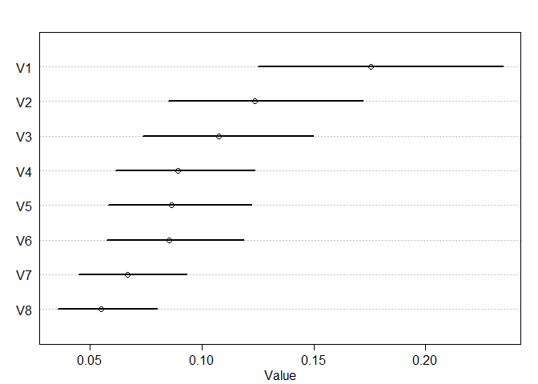
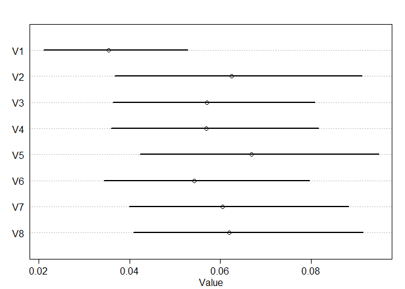
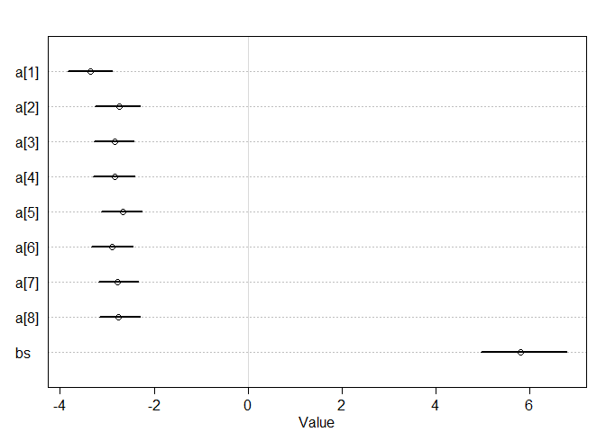

Pagoda Peak
================
Joseph Bakita
3/14/2022

``` r
map = array(dim = 44)
map[1] = 1 #blue space
map[2] = 1
map[3] = 2 #red space
map[4] = 3 #rocket space
map[5] = 1
map[6] = 1
map[7] = 4 #mic
map[8] = 1
map[9] = 1
map[10] = 5 #DK
map[11] = 1
map[12] = 6 #gong
map[13] = 1
map[14] = 2
map[15] = 1
map[16] = 7 #duel
map[17] = 7
map[18] = 7
map[19] = 8 #waterfall
map[20] = 2
map[21] = 5
map[22] = 1
map[23] = 1
map[24] = 1
map[25] = 1
map[26] = 1
map[27] = 1
map[28] = 2
map[29] = 1
map[30] = 1
map[31] = 6
map[32] = 1
map[33] = 4
map[34] = 9 #Bowser
map[35] = 10 #Statue
map[36] = 1
map[37] = 2
map[38] = 1
map[39] = 10
map[40] = 1
map[41] = 1
map[42] = 11 #Throwback
map[43] = 1
map[44] = 0
```

``` r
coins = array(data = 0, dim = 4)
players = data.frame(coins)
players$wins = 0

s = 1000

wins1 = array(data = 0, dim = s)
wins2 = array(data = 0, dim = s)
wins3 = array(data = 0, dim = s)
wins4 = array(data = 0, dim = s)
skill1 = array(data = 0, dim = s)
skill2 = array(data = 0, dim = s)
skill3 = array(data = 0, dim = s)
skill4 = array(data = 0, dim = s)
scoreboard = data.frame(wins1, wins2, wins3, wins4, skill1, skill2, skill3, skill4)


for (k in 1:s) {
  
scoreboard$turns[k] = 10 + 5*sample(1:8, 1)

for(i in 1:4) {
  players$skill[i] = runif(1, min=0)
}
players$skill=players$skill/sum(players$skill)
for(i in 5:8) {
  scoreboard[k,c(i)] = players$skill[i-4]
}           #Random Skill Generation + Scaling
    
players$stars = 0
players$item1 = 0
players$item2 = 0
players$item3 = 0
players$status = 0
players$place1 = 44
players$place2 = 0
star_price = 10
players$coins = 10

#for(i in 1:4) {
#  players$skill[i] = runif(1, min=0)
#  scoreboard[k,c(4+i)] = players$skill[i]
#}

for (i in 1:scoreboard$turns[k]) {
  for (j in 1:4) {
    roll = sample(1:10,1)
    if (players$status[j] == 1 | players$status[j] == 2) {
      players$place2[j] = (players$place1[j] + 2 * roll) %% 44 + 1
    } else {
      players$place2[j] = (players$place1[j] + roll) %% 44 + 1
    }
    
    if (players$place1[j] + roll > 43 & players$coins[j] >= star_price) {
      players$stars[j] = players$stars[j] + 1
      players$coins[j] = players$coins[j] - star_price
      star_price = star_price + 10          #Star purchase
      if (star_price > 40) star_price = star_price - 40
    }
    
    if (map[players$place2[j]]==1) {
      players$coins[j] = players$coins[j] + 3          #Landing on a blue space
    } else if (map[players$place2[j]]==2) {
      players$coins[j] = players$coins[j] - 3          #Landing on a red space
    } else if (map[players$place2[j]]==7) {
      
      t = 0 
      t1 = 0 #opponent's stars
      t2 = 0 #opponent's coins
      for(n in 1:4) {
        if(n != j) {  
          if (players$stars[n] > t1) {
            t = n
            t1 = players$stars[n]
            t2 = players$coins[n]
          } else if (players$stars[n] == t1 & players$coins[n] > t2) {
            t = n
            t2 = players$coins[n]
          }
        }
      }          #Choosing the most valuable opponent
      
      t3 = sample(1:5,1)
      t4 = rbinom(1,size=1, prob = players$skill[j]/(players$skill[j]+players$skill[t]))
      if (t3 == 2) {          #10 coins
        if (players$coins[j] >= 10 & t2 >= 10) {
          players$coins[j] = players$coins[j]-10 + 20*t4
          players$coins[t] = players$coins[t]+10 - 20*t4
        } else if (t4 == 1) {
          players$coins[j] = players$coins[j]+players$coins[t]
          players$coins[t] = 0
        } else {
          players$coins[t] = players$coins[j]+players$coins[t]
          players$coins[j] = 0
        }
          
      } else if (t3 == 3) {
        players$coins[t] = t4*(players$coins[j] + round(players$coins[t]/2))
        players$coins[j] = t4*(players$coins[j]+round(t2/2))
      } else if (t3 == 4) {          #All coins
        players$coins[t] = t4*(players$coins[j] + players$coins[t])
        players$coins[j] = t4*(players$coins[j]+t2)
      } else if (t3 == 5) {          #Star
        if (players$stars[j] > 0 & t4 == 0) {
          players$stars[j] = players$stars[j]-1
          players$stars[t] = players$stars[t]+1 
        } else if (players$stars[t] & t4==1) {
          players$stars[j] = players$stars[j]+1
          players$stars[t] = players$stars[t]-1 
        }
      }
      
    }          #Landing on a duel space
    
    players$place1[j] = players$place2[j]
    
  }
  if (rbinom(1,size=1,prob = players$skill[1])==1) {
    minigame = 1
  } else if (rbinom(1,size=1,prob = players$skill[2]/(players$skill[2]+players$skill[3]+players$skill[4]))==1) {
    minigame = 2
  } else if (rbinom(1,size=1,prob = players$skill[3]/(players$skill[3]+players$skill[4]))==1) {
    minigame = 3
  } else minigame = 4
  players$coins[minigame] = players$coins[minigame] + 10
}

for (j in 1:4) {
  t = 0
  for (m in 1:4) {
    if (players$stars[j] > players$stars[m]) {
      t = t + 1
    } else if (players$stars[j] == players$stars[m] & players$coins[j] > players$coins[m]) {
      t = t + 1
    }
    
  }
  if (t == 3) { 
    players$wins[j] = players$wins[j] + 1
    scoreboard[k, c(j)] = scoreboard[k, c(j)] + 1
    scoreboard$winner[k] = j
  }
  
}
}
```

``` r
library(rethinking)
```

    ## Loading required package: rstan

    ## Loading required package: StanHeaders

    ## Loading required package: ggplot2

    ## rstan (Version 2.21.3, GitRev: 2e1f913d3ca3)

    ## For execution on a local, multicore CPU with excess RAM we recommend calling
    ## options(mc.cores = parallel::detectCores()).
    ## To avoid recompilation of unchanged Stan programs, we recommend calling
    ## rstan_options(auto_write = TRUE)

    ## Do not specify '-march=native' in 'LOCAL_CPPFLAGS' or a Makevars file

    ## Loading required package: cmdstanr

    ## This is cmdstanr version 0.4.0.9001

    ## - CmdStanR documentation and vignettes: mc-stan.org/cmdstanr

    ## - CmdStan path: C:/Users/jbakit/Documents/.cmdstan/cmdstan-2.28.2

    ## - CmdStan version: 2.28.2

    ## 
    ## A newer version of CmdStan is available. See ?install_cmdstan() to install it.
    ## To disable this check set option or environment variable CMDSTANR_NO_VER_CHECK=TRUE.

    ## Loading required package: parallel

    ## rethinking (Version 2.21)

    ## 
    ## Attaching package: 'rethinking'

    ## The following object is masked from 'package:rstan':
    ## 
    ##     stan

    ## The following object is masked from 'package:stats':
    ## 
    ##     rstudent

``` r
d <- list(
  win = scoreboard$wins1,
  skill = scoreboard$skill1,
  turns = scoreboard$turns/5-2
)

model <- ulam( alist(
  win ~ dbinom(1, p),
  logit(p) <- bs*skill + bt[turns],
  bs ~ dnorm(0, 1.5),
  bt[turns] ~ dnorm(0,1.5)
), data = d, chains = 4, log_lik=TRUE, cores = parallel::detectCores())
```

    ## Running MCMC with 4 parallel chains, with 1 thread(s) per chain...
    ## 
    ## Chain 2 Iteration:   1 / 1000 [  0%]  (Warmup) 
    ## Chain 3 Iteration:   1 / 1000 [  0%]  (Warmup) 
    ## Chain 4 Iteration:   1 / 1000 [  0%]  (Warmup) 
    ## Chain 1 Iteration:   1 / 1000 [  0%]  (Warmup) 
    ## Chain 1 Iteration: 100 / 1000 [ 10%]  (Warmup) 
    ## Chain 2 Iteration: 100 / 1000 [ 10%]  (Warmup) 
    ## Chain 3 Iteration: 100 / 1000 [ 10%]  (Warmup) 
    ## Chain 4 Iteration: 100 / 1000 [ 10%]  (Warmup) 
    ## Chain 2 Iteration: 200 / 1000 [ 20%]  (Warmup) 
    ## Chain 1 Iteration: 200 / 1000 [ 20%]  (Warmup) 
    ## Chain 3 Iteration: 200 / 1000 [ 20%]  (Warmup) 
    ## Chain 4 Iteration: 200 / 1000 [ 20%]  (Warmup) 
    ## Chain 2 Iteration: 300 / 1000 [ 30%]  (Warmup) 
    ## Chain 1 Iteration: 300 / 1000 [ 30%]  (Warmup) 
    ## Chain 3 Iteration: 300 / 1000 [ 30%]  (Warmup) 
    ## Chain 4 Iteration: 300 / 1000 [ 30%]  (Warmup) 
    ## Chain 1 Iteration: 400 / 1000 [ 40%]  (Warmup) 
    ## Chain 2 Iteration: 400 / 1000 [ 40%]  (Warmup) 
    ## Chain 3 Iteration: 400 / 1000 [ 40%]  (Warmup) 
    ## Chain 4 Iteration: 400 / 1000 [ 40%]  (Warmup) 
    ## Chain 2 Iteration: 500 / 1000 [ 50%]  (Warmup) 
    ## Chain 1 Iteration: 500 / 1000 [ 50%]  (Warmup) 
    ## Chain 2 Iteration: 501 / 1000 [ 50%]  (Sampling) 
    ## Chain 1 Iteration: 501 / 1000 [ 50%]  (Sampling) 
    ## Chain 3 Iteration: 500 / 1000 [ 50%]  (Warmup) 
    ## Chain 3 Iteration: 501 / 1000 [ 50%]  (Sampling) 
    ## Chain 4 Iteration: 500 / 1000 [ 50%]  (Warmup) 
    ## Chain 4 Iteration: 501 / 1000 [ 50%]  (Sampling) 
    ## Chain 2 Iteration: 600 / 1000 [ 60%]  (Sampling) 
    ## Chain 1 Iteration: 600 / 1000 [ 60%]  (Sampling) 
    ## Chain 3 Iteration: 600 / 1000 [ 60%]  (Sampling) 
    ## Chain 4 Iteration: 600 / 1000 [ 60%]  (Sampling) 
    ## Chain 2 Iteration: 700 / 1000 [ 70%]  (Sampling) 
    ## Chain 1 Iteration: 700 / 1000 [ 70%]  (Sampling) 
    ## Chain 3 Iteration: 700 / 1000 [ 70%]  (Sampling) 
    ## Chain 4 Iteration: 700 / 1000 [ 70%]  (Sampling) 
    ## Chain 2 Iteration: 800 / 1000 [ 80%]  (Sampling) 
    ## Chain 1 Iteration: 800 / 1000 [ 80%]  (Sampling) 
    ## Chain 3 Iteration: 800 / 1000 [ 80%]  (Sampling) 
    ## Chain 4 Iteration: 800 / 1000 [ 80%]  (Sampling) 
    ## Chain 2 Iteration: 900 / 1000 [ 90%]  (Sampling) 
    ## Chain 1 Iteration: 900 / 1000 [ 90%]  (Sampling) 
    ## Chain 3 Iteration: 900 / 1000 [ 90%]  (Sampling) 
    ## Chain 4 Iteration: 900 / 1000 [ 90%]  (Sampling) 
    ## Chain 2 Iteration: 1000 / 1000 [100%]  (Sampling) 
    ## Chain 2 finished in 8.2 seconds.
    ## Chain 1 Iteration: 1000 / 1000 [100%]  (Sampling) 
    ## Chain 1 finished in 8.3 seconds.
    ## Chain 3 Iteration: 1000 / 1000 [100%]  (Sampling) 
    ## Chain 4 Iteration: 1000 / 1000 [100%]  (Sampling) 
    ## Chain 3 finished in 8.5 seconds.
    ## Chain 4 finished in 8.5 seconds.
    ## 
    ## All 4 chains finished successfully.
    ## Mean chain execution time: 8.4 seconds.
    ## Total execution time: 9.1 seconds.

``` r
precis(model, depth = 2)
```

    ##            mean        sd      5.5%     94.5%    n_eff     Rhat4
    ## bs     6.165299 0.5306500  5.318574  6.979618  775.506 1.0017663
    ## bt[1] -1.564340 0.2316108 -1.944977 -1.182297 1360.345 0.9998772
    ## bt[2] -1.980817 0.2476450 -2.376539 -1.572474 1192.726 1.0006435
    ## bt[3] -2.139195 0.2469328 -2.534250 -1.735696 1133.362 0.9991979
    ## bt[4] -2.346548 0.2489974 -2.731842 -1.959086 1098.473 0.9987127
    ## bt[5] -2.382687 0.2502757 -2.788067 -1.973342 1270.483 1.0008684
    ## bt[6] -2.398818 0.2455989 -2.801849 -2.005476 1219.080 1.0000057
    ## bt[7] -2.664442 0.2451890 -3.056149 -2.276453 1191.402 1.0019033
    ## bt[8] -2.881589 0.2662024 -3.305335 -2.443555 1333.648 0.9996001

``` r
post <- extract.samples(model)
win <- inv_logit( post$bt )
plot( precis( as.data.frame(win) ) )
```

<!-- -->

``` r
#win <- inv_logit( post$bs )
#plot( precis( as.data.frame(win) ) , xlim=c(0,1) )

#plot(precis(model, depth =2))
```

``` r
d2 <- list(
  win = scoreboard$wins4,
  skill = scoreboard$skill4,
  turns = scoreboard$turns/5-2
)

model2 <- ulam( alist(
  win ~ dbinom(1, p),
  logit(p) <- a[turns] + bs*skill,
  a[turns] ~ dnorm(0, 1.5),
  bs ~ dnorm(0, 1.5)
), data = d2, chains = 1, log_lik=TRUE)
```

    ## Running MCMC with 1 chain, with 1 thread(s) per chain...
    ## 
    ## Chain 1 Iteration:   1 / 1000 [  0%]  (Warmup) 
    ## Chain 1 Iteration: 100 / 1000 [ 10%]  (Warmup) 
    ## Chain 1 Iteration: 200 / 1000 [ 20%]  (Warmup) 
    ## Chain 1 Iteration: 300 / 1000 [ 30%]  (Warmup) 
    ## Chain 1 Iteration: 400 / 1000 [ 40%]  (Warmup) 
    ## Chain 1 Iteration: 500 / 1000 [ 50%]  (Warmup) 
    ## Chain 1 Iteration: 501 / 1000 [ 50%]  (Sampling) 
    ## Chain 1 Iteration: 600 / 1000 [ 60%]  (Sampling) 
    ## Chain 1 Iteration: 700 / 1000 [ 70%]  (Sampling) 
    ## Chain 1 Iteration: 800 / 1000 [ 80%]  (Sampling) 
    ## Chain 1 Iteration: 900 / 1000 [ 90%]  (Sampling) 
    ## Chain 1 Iteration: 1000 / 1000 [100%]  (Sampling) 
    ## Chain 1 finished in 9.3 seconds.

``` r
precis(model2, depth = 2)
```

    ##           mean        sd      5.5%     94.5%    n_eff     Rhat4
    ## a[1] -3.348781 0.3098688 -3.839842 -2.886928 269.4310 1.0012994
    ## a[2] -2.747123 0.2987660 -3.267685 -2.300095 177.2348 1.0017183
    ## a[3] -2.838022 0.2725627 -3.278474 -2.431106 279.7339 0.9984952
    ## a[4] -2.841010 0.2779793 -3.290581 -2.420340 222.3209 1.0014383
    ## a[5] -2.669554 0.2839802 -3.119825 -2.255545 204.8614 0.9988025
    ## a[6] -2.893090 0.2818286 -3.337360 -2.448308 260.5468 0.9982745
    ## a[7] -2.774078 0.2694868 -3.180622 -2.335917 278.6163 1.0004967
    ## a[8] -2.750723 0.2719348 -3.154758 -2.296576 210.8977 1.0010177
    ## bs    5.813849 0.5700656  4.953095  6.790909 128.2362 1.0004770

``` r
post <- extract.samples(model2)
win <- inv_logit( post$a )
plot( precis( as.data.frame(win) ) )
```

<!-- -->

``` r
#win <- inv_logit( post$bs )
#plot( precis( as.data.frame(win) ) , xlim=c(0,1) )

plot(precis(model2, depth =2))
```

<!-- -->
